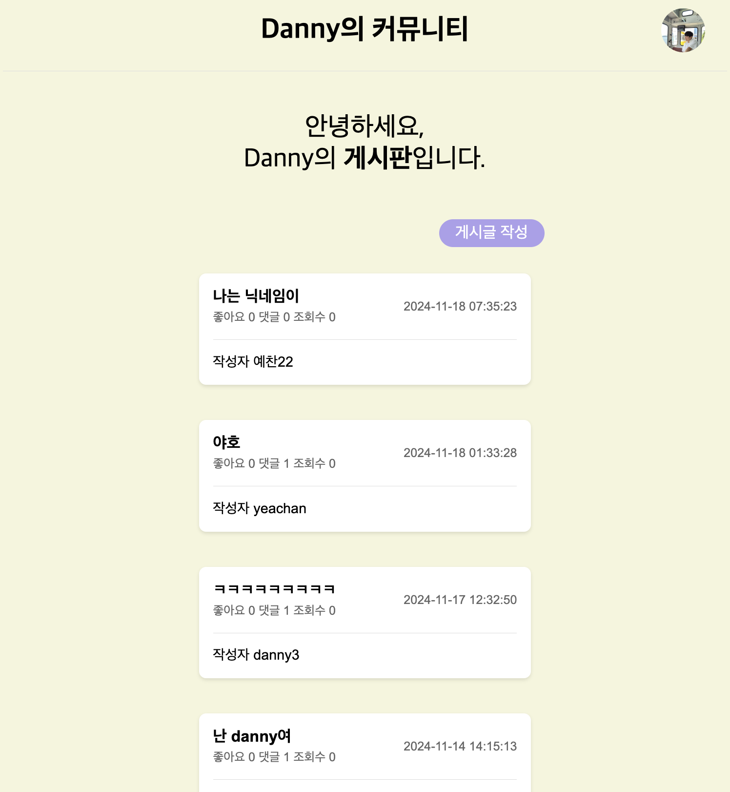

# 2-danny-oh-community-fe
커뮤니티 프로젝트 프론트엔드 저장소

## 기능
로그인 - 완료
회원가입 - 완료
회원정보 수정 - 완료
회원탈퇴 - 완료
비밀번호 수정 - 완료
게시글 목록 - 완료
게시글 작성 - 완료
게시글 삭제 - 완료
게시글 수정 - 완료
댓글 작성 - 완료
댓글 수정 - 완료
댓글 삭제 - 완료

## 실행 방법
**1. 클론 후 의존성 설치**
**2. 'node app.js' 명령어 실행**

# 백엔드 저장소
https://github.com/100-hours-a-week/2-danny-oh-community-be